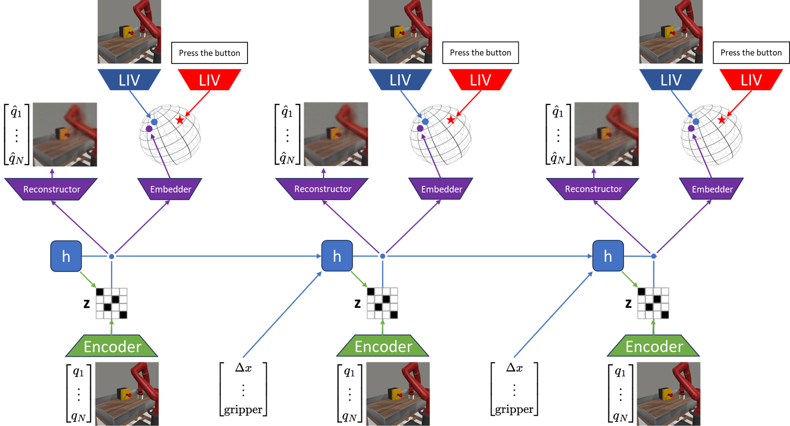
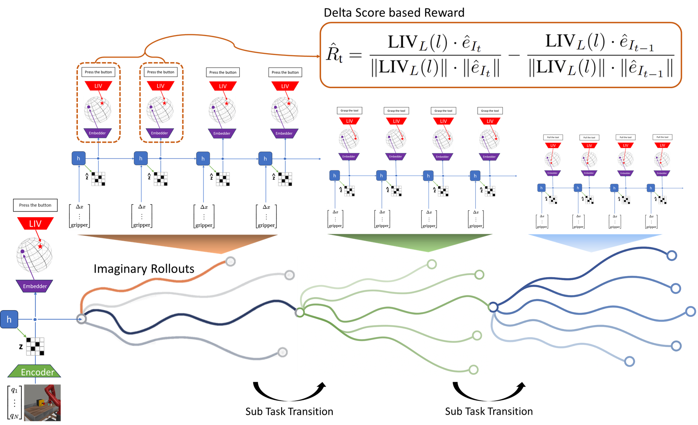
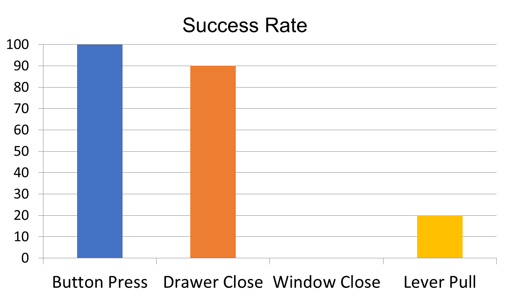
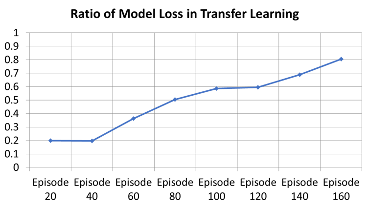
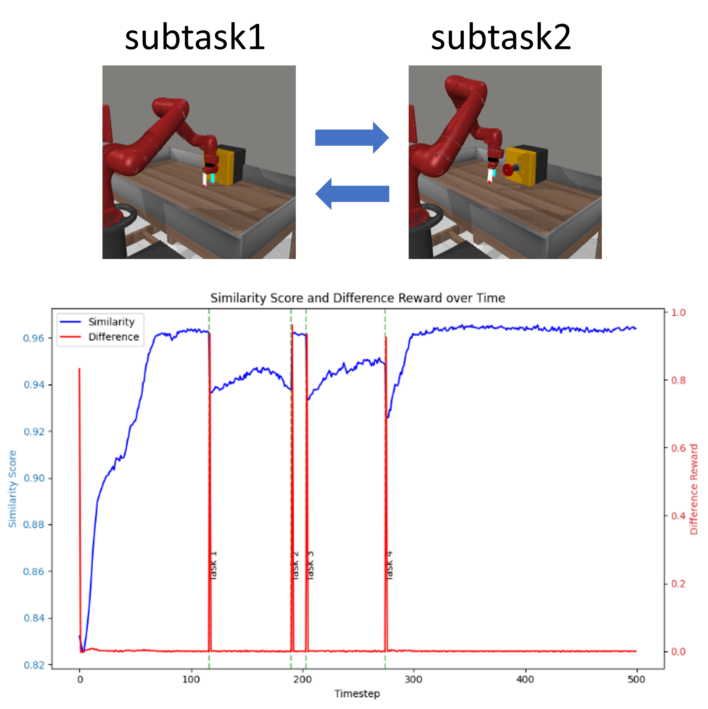
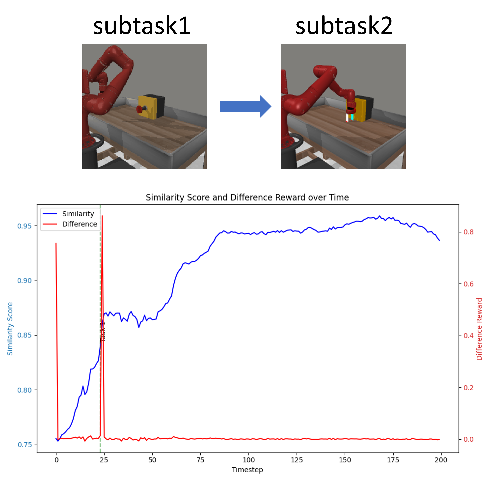
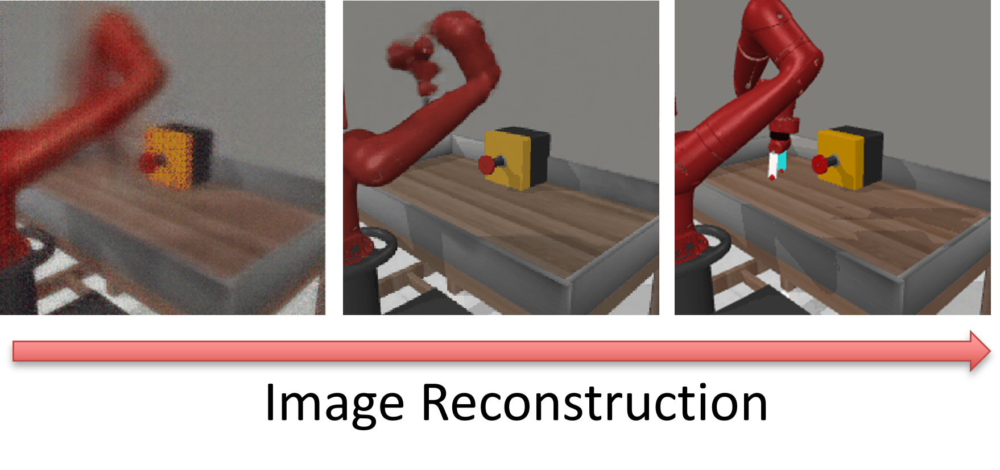

# LIVerse: Language & Image integrated uniVerse Model

[](https://www.python.org/downloads/)
[](https://pytorch.org/)
[](LICENSE)

> A **World Foundation Model** that unifies vision-language semantics and forward dynamics for zero-shot robotic policy execution via model predictive control.

<p align="center">
  
</p>

## Highlights

- **World Foundation Model** -- Unifies vision-language semantics (LIV/CLIP) with forward dynamics (RSSM) in a single latent space, extending DreamerV3 with VLM-based reward signals
- **Zero-Shot MPC Policy** -- Converts a trained world model into a zero-shot policy via sampling-based model predictive control (CEM), requiring no additional task-specific training
- **Delta-Score Reward** -- A novel reward function measuring *incremental* similarity improvement (`sim_t - sim_{t-1}`) that resolves reward scale mismatch across subtasks
- **Step-wise Planning** -- Adaptive multi-subtask decomposition with automatic goal switching via plateau detection

## Architecture

<p align="center">
  
</p>

LIVerse combines a DreamerV3 world model with a PlaNet-style MPC planner:

1. **World Model Training**: The RSSM-based world model learns environment dynamics from image observations, with LIV providing dense reward signals via cosine similarity in the shared vision-language embedding space.
2. **Zero-Shot Planning**: At test time, the Cross-Entropy Method (CEM) optimizes action sequences by rolling out candidate trajectories through the learned world model and selecting those that maximize similarity to the goal embedding.
3. **Delta-Score Rewards**: Instead of absolute similarity, the planner optimizes for incremental progress (`delta_sim = sim_t - sim_{t-1}`), enabling consistent optimization across subtasks with varying baseline similarities.

## Results

### Zero-Shot Policy Execution
<p align="center">
  
</p>

### Transfer Learning Across Tasks
<p align="center">
  
</p>

### Step-wise Planning
<p align="center">
  
  
</p>

### World Model Image Reconstruction
<p align="center">
  
</p>

## Installation

```bash
# Clone the repository
git clone https://github.com/your-username/LIVerse_MBRL.git
cd LIVerse_MBRL

# Install the package
pip install -e ".[dmc]"

# LIV model downloads automatically on first use (~/.liv/resnet50/)
```

**Requirements**: Python 3.9+, PyTorch 2.0+, CUDA GPU, MuJoCo (for DMC/MetaWorld tasks)

## Quick Start

### Train World Model
```bash
# MetaWorld robotic manipulation
python scripts/train.py --configs metaworld \
    --task ML1_button-press-v2 \
    --logdir ./logdir/button_press

# DeepMind Control Suite
python scripts/train.py --configs dmc_vision \
    --task dmc_walker_walk \
    --logdir ./logdir/walker_walk
```

### Zero-Shot MPC Planning
```bash
# Single-goal planning with cosine similarity reward
python scripts/plan_basic.py --configs metaworld \
    --task ML1_button-press-v2 \
    --logdir ./logdir/button_press \
    --planning_horizon 12 --candidates 1000 \
    --reward_form similarity

# Step-wise planning with delta-score reward
python scripts/plan_stepwise.py --configs metaworld \
    --task ML1_button-press-v2 \
    --logdir ./logdir/button_press \
    --step_wise True --subtask_dir ./subtasks \
    --reward_form difference
```

### Evaluate
```bash
python scripts/evaluate.py --configs metaworld \
    --task ML1_button-press-v2 \
    --logdir ./logdir/button_press
```

### Monitor Training
```bash
tensorboard --logdir ./logdir
```

## Project Structure

```
LIVerse_MBRL/
├── liverse/                    # Core library (pip-installable)
│   ├── agents/                 # Dreamer agent, exploration strategies
│   ├── models/                 # WorldModel, ImagBehavior (actor-critic)
│   ├── networks/               # RSSM, encoder, decoder, MLP
│   ├── distributions/          # Categorical, continuous, bounded distributions
│   ├── planning/               # MPC planner (CEM), reward functions
│   ├── envs/                   # Environment wrappers (DMC, MetaWorld, Atari, ...)
│   ├── utils/                  # Logger, optimizer, data I/O, math, etc.
│   └── parallel.py             # Multi-process environment execution
│
├── scripts/                    # Entry point scripts
│   ├── train.py                # World model training
│   ├── plan_basic.py           # Single-goal MPC planning
│   ├── plan_stepwise.py        # Step-wise MPC planning
│   └── evaluate.py             # Model evaluation
│
├── configs/                    # Configuration files
│   ├── dreamer.yaml            # Training configs (DMC, MetaWorld, Atari, ...)
│   └── planet.yaml             # MPC planning configs
│
├── third_party/                # External dependencies
│   ├── liv/                    # LIV vision-language model
│   └── Metaworld/              # Meta-World benchmark
│
├── paper_workspace/            # Thesis LaTeX source and figures
└── pyproject.toml              # Package definition
```

## Configuration

Configs use hierarchical YAML with CLI overrides:

```
defaults → suite preset (metaworld, dmc_vision, atari100k, ...) → CLI args
```

Key planning parameters:

| Parameter | Default | Description |
|-----------|---------|-------------|
| `planning_horizon` | 12 | MPC lookahead steps |
| `candidates` | 1000 | CEM candidate action sequences |
| `top_candidates` | 100 | Elite candidates for distribution update |
| `optimization_iters` | 10 | CEM refinement iterations |
| `reward_form` | `similarity` | `similarity` (absolute) or `difference` (delta-score) |
| `similarity_threshold` | 0.0012 | Plateau detection threshold (step-wise mode) |

## Citation

```bibtex
@article{liverse2025,
  title={LIVerse: Language \& Image integrated uniVerse Model for Robot Foundation Models},
  author={Kyungseo Park},
  year={2025}
}
```

## Acknowledgments

Built upon [DreamerV3](https://github.com/danijar/dreamerv3) | [dreamerv3-torch](https://github.com/NM512/dreamerv3-torch) | [PlaNet](https://github.com/Kaixhin/PlaNet) | [LIV](https://github.com/penn-pal-lab/LIV) | [Meta-World](https://github.com/Farama-Foundation/Metaworld)

## License

MIT License
